[](https://travis-ci.org/karthik/wesanderson)

# Wes Anderson Palettes


> I saved you from boring plots. What did you ever do? - Max Fischer (probably)

Tired of generic mass produced palettes for your plots? Short of adding an owl and dressing up your plot in a bowler hat, here's the most indie thing you can do to one. First round of palettes derived from the amazing Tumblr blog [Wes Anderson Palettes.](http://wesandersonpalettes.tumblr.com/)

```coffee
install.packages("wesanderson")
```

__Or the development version__

```coffee
devtools::install_github("karthik/wesanderson")
```


__Current list of available palettes__


```coffee
library(wesanderson)
namelist
```


|     movies     |  wesnums  |
| -------------- | --------- |
| GrandBudapest  |     4     |
|   Moonrise1    |     4     |
|     Royal1     |     4     |
|   Moonrise2    |     4     |
|   Cavalcanti   |     5     |
|     Royal2     |     5     |
| GrandBudapest2 |     4     |
|   Moonrise3    |     5     |
|   Chevalier    |     4     |
|     Zissou     |     5     |
|  FantasticFox  |     5     |
|   Darjeeling   |     5     |
|    Rushmore    |     5     |
|  BottleRocket  |     7     |
|  Darjeeling2   |     5     |


__See the palettes__

## Grand Budapest


```coffee
display.wes.palette(4, "GrandBudapest")
```

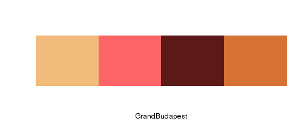 

```coffee
display.wes.palette(4, "GrandBudapest2")
```

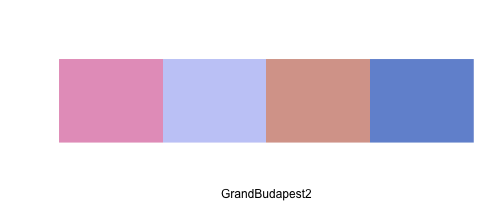 


```coffee
ggplot(iris, aes(Sepal.Length, Sepal.Width, color = Species)) + 
geom_point(size = 3) + 
scale_color_manual(values = wes.palette(3, "GrandBudapest")) + 
theme_gray()
```

 


## Moonrise Kingdom


```coffee
display.wes.palette(4, "Moonrise1")
```

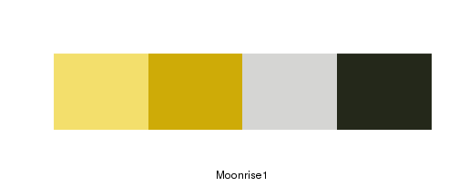 

```coffee
display.wes.palette(4, "Moonrise2")
```

 

```coffee
display.wes.palette(5, "Moonrise3")
```

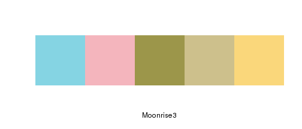 


## Royal Tannenbaums


```coffee
display.wes.palette(4, "Royal1")
```

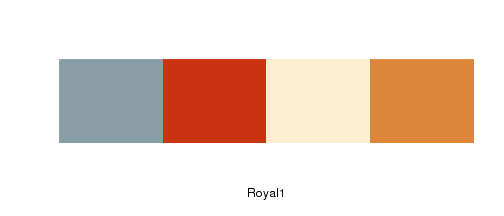 

```coffee
display.wes.palette(5, "Royal2")
```

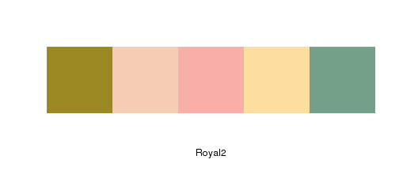 


```coffee
qplot(factor(cyl), data=mtcars, geom="bar", fill=factor(vs)) + 
scale_fill_manual(values = wes.palette(2, "Royal1"))
```

 


## Castello Cavalcanti


```coffee
display.wes.palette(5, "Cavalcanti")
```

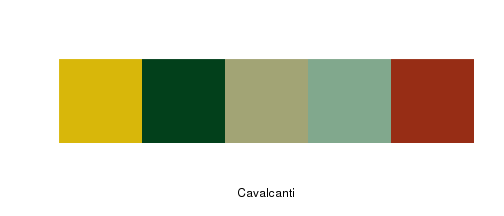 


## Hotel Chevalier


```coffee
display.wes.palette(4, "Chevalier")
```

 


## The Life Aquatic


```coffee
display.wes.palette(5, "Zissou")
```

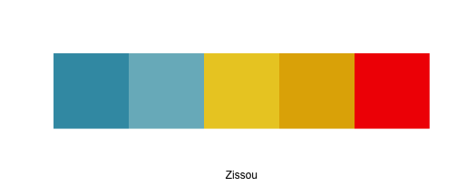 


```coffee
pal <- wes.palette(name = "Zissou", type = "continuous")
image(volcano, col = pal(21))
```

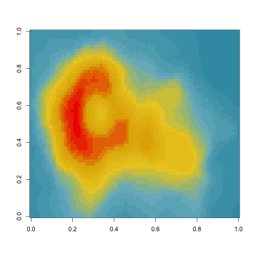 


```coffee
library(wesanderson)
pal <- wes.palette(name = "Zissou", type = "continuous")
# heatmap is a local dataset
ggplot(heatmap, aes(x = X2, y = X1, fill = value)) +
 geom_tile() + 
 scale_fill_gradientn(colours = pal(100)) + 
scale_x_discrete(expand = c(0, 0)) +
scale_y_discrete(expand = c(0, 0)) + coord_equal() 
```

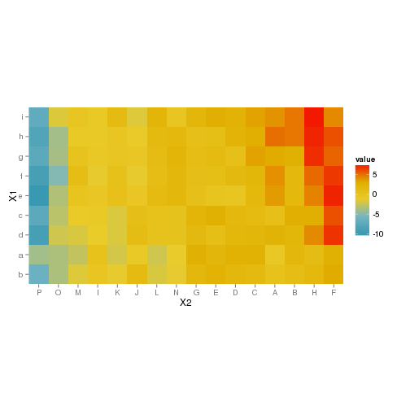 


## Darjeeling Limited


```coffee
display.wes.palette(5, "Darjeeling")
```

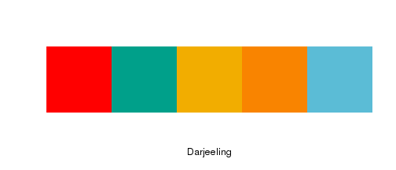 

```coffee
display.wes.palette(5, "Darjeeling2")
```

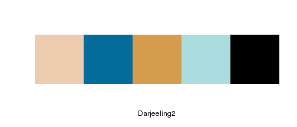 


```coffee
display.wes.palette(4, "FantasticFox")
```

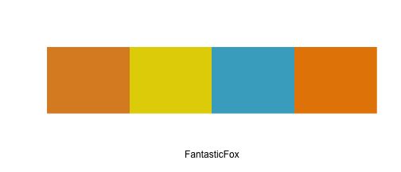 


## Rushmore


```coffee
display.wes.palette(4, "Rushmore")
```

 


## Bottle Rocket


```coffee
display.wes.palette(6, "BottleRocket")
```

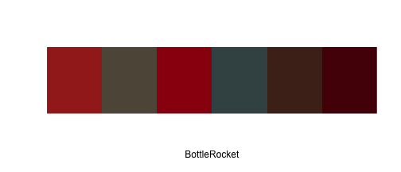 


---


## Gallery of examples

* [Reading Secure Data Into R from Dropbox](http://aaronbaggett.com/notes/2014/03/28/reading-secure-data-into-r-from-dropbox/)


