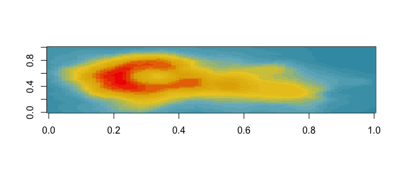

---
---

<!-- README.md is generated from README.Rmd. Please edit that file -->


# Wes Anderson Palettes

[](https://travis-ci.org/karthik/wesanderson)  


> I saved you from boring plots. What did you ever do? - Max Fischer (probably)

Tired of generic mass produced palettes for your plots? Short of adding an owl and dressing up your plot in a bowler hat, here's the most indie thing you can do to one. First round of palettes derived from the amazing Tumblr blog [Wes Anderson Palettes.](http://wesandersonpalettes.tumblr.com/)

## Installation

```R
install.packages("wesanderson")
```

__Or the development version__

```R
devtools::install_github("karthik/wesanderson")
```

## Usage


```r
library(wesanderson)

# See all palettes
names(wes_palettes)
#>  [1] "GrandBudapest"  "Moonrise1"      "Royal1"         "Moonrise2"     
#>  [5] "Cavalcanti"     "Royal2"         "GrandBudapest2" "Moonrise3"     
#>  [9] "Chevalier"      "Zissou"         "FantasticFox"   "Darjeeling"    
#> [13] "Rushmore"       "BottleRocket"   "Darjeeling2"
```

### Grand Budapest


```r
library(ggplot2)
ggplot(iris, aes(Sepal.Length, Sepal.Width, color = Species)) + 
  geom_point(size = 3) + 
  scale_color_manual(values = wes_palette("GrandBudapest")) + 
  theme_gray()
```


## Moonrise Kingdom


```r
wes_palette("Moonrise1")
```


```r
wes_palette("Moonrise2")
```


```r
wes_palette("Moonrise3")
```


## Royal Tenenbaums


```r
wes_palette("Royal1")
```


```r
wes_palette("Royal2")
```


```r
qplot(factor(cyl), data=mtcars, geom="bar", fill=factor(vs)) + 
  scale_fill_manual(values = wes_palette("Royal1"))
```


## Castello Cavalcanti


```r
wes_palette("Cavalcanti")
```


## Hotel Chevalier


```r
wes_palette("Chevalier")
```


## The Life Aquatic


```r
wes_palette("Zissou")
```


```r
pal <- wes_palette("Zissou", 21, type = "continuous")
image(volcano, col = pal)
```




```r
pal <- wes_palette("Zissou", 100, type = "continuous")
# heatmap is a local dataset
ggplot(heatmap, aes(x = X2, y = X1, fill = value)) +
  geom_tile() + 
  scale_fill_gradientn(colours = pal) + 
  scale_x_discrete(expand = c(0, 0)) +
  scale_y_discrete(expand = c(0, 0)) + 
  coord_equal() 
```


## Darjeeling Limited


```r
wes_palette("Darjeeling")
```


```r
wes_palette("Darjeeling2")
```


## Fantastic Mr. Fox


```r
wes_palette("FantasticFox")
```


## Rushmore


```r
wes_palette("Rushmore")
```


## Bottle Rocket


```r
wes_palette("BottleRocket2")
#> Error in wes_palette("BottleRocket2"): Palette not found.
```

---

## Gallery of examples

* [Reading Secure Data Into R from Dropbox](http://aaronbaggett.com/notes/2014/03/28/reading-secure-data-into-r-from-dropbox/)


* [osmplotr](https://github.com/mpadge/osmplotr)

![][londonmap](https://raw.githubusercontent.com/mpadge/osmplotr/master/figure/map6.png)

