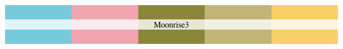
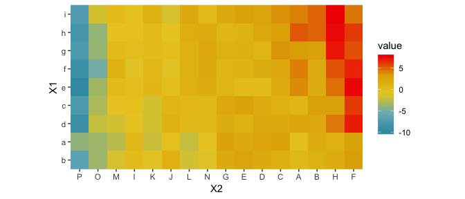

<!-- README.md is generated from README.Rmd. Please edit that file -->
Wes Anderson Palettes
=====================

[](https://travis-ci.org/karthik/wesanderson)  
[](http://cran.rstudio.com/web/packages/wesanderson/index.html)  


> I saved you from boring plots. What did you ever do? - Max Fischer (probably)

Tired of generic mass produced palettes for your plots? Short of adding an owl and dressing up your plot in a bowler hat, here's the most indie thing you can do to one. First round of palettes derived from the amazing Tumblr blog [Wes Anderson Palettes.](http://wesandersonpalettes.tumblr.com/)

Installation
------------

``` r
install.packages("wesanderson")
```

**Or the development version**

``` r
devtools::install_github("karthik/wesanderson")
```

Usage
-----

``` r
library(wesanderson)

# See all palettes
names(wes_palette)
#> NULL
```

### Grand Budapest

``` r
library(ggplot2)
ggplot(iris, aes(Sepal.Length, Sepal.Width, color = Species)) + 
  geom_point(size = 3) + 
  scale_color_manual(values = wes_palette("GrandBudapest")) + 
  theme_gray()
```


Moonrise Kingdom
----------------

``` r
wes_palette("Moonrise1")
```


``` r
wes_palette("Moonrise2")
```


``` r
wes_palette("Moonrise3")
```



Royal Tannenbaums
-----------------

``` r
wes_palette("Royal1")
```


``` r
wes_palette("Royal2")
```


``` r
qplot(factor(cyl), data=mtcars, geom="bar", fill=factor(vs)) + 
  scale_fill_manual(values = wes_palette("Royal1"))
```


Castello Cavalcanti
-------------------

``` r
wes_palette("Cavalcanti")
```


Hotel Chevalier
---------------

``` r
wes_palette("Chevalier")
```


The Life Aquatic
----------------

``` r
wes_palette("Zissou")
```


``` r
pal <- wes_palette("Zissou", 21, type = "continuous")
image(volcano, col = pal)
```


``` r
pal <- wes_palette("Zissou", 100, type = "continuous")
# heatmap is a local dataset
ggplot(heatmap, aes(x = X2, y = X1, fill = value)) +
  geom_tile() + 
  scale_fill_gradientn(colours = pal) + 
  scale_x_discrete(expand = c(0, 0)) +
  scale_y_discrete(expand = c(0, 0)) + 
  coord_equal() 
```



Darjeeling Limited
------------------


``` r
wes_palette("Darjeeling")
```


``` r
wes_palette("Darjeeling2")
```


Fantastic Mr. Fox
-----------------

``` r
wes_palette("FantasticFox")
```


Rushmore
--------

``` r
wes_palette("Rushmore")
```


Bottle Rocket
-------------

Coming soon

------------------------------------------------------------------------

Gallery of examples
-------------------

-   [Reading Secure Data Into R from Dropbox](http://aaronbaggett.com/notes/2014/03/28/reading-secure-data-into-r-from-dropbox/)


