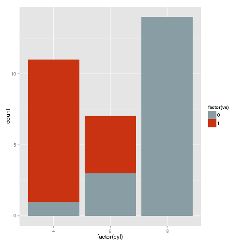
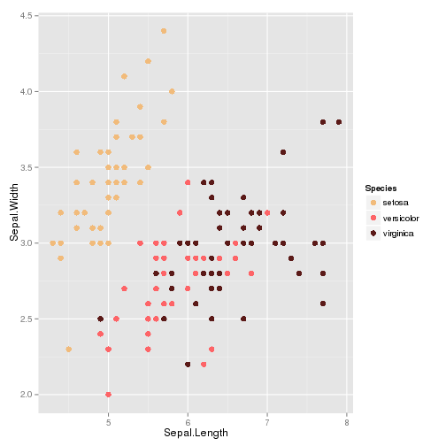

# Wes Anderson Palettes


> I saved you from boring plots. What did you ever do? - Max Fischer (probably)

Tired of generic mass produced palettes for your plots? Short of adding an owl and dressing up your plot in a bowler hat, here's the most indie thing you can do to a plot. 

```coffee
devtools::install_github("karthik/wesanderson")
```


__Current list of available palettes__


```r
library(wesanderson)
namelist
```


|     movies     |  wesnums  |
| -------------- | --------- |
| GrandBudapest  |     4     |
|   Moonrise1    |     4     |
|     Royal1     |     4     |
|   Moonrise2    |     4     |
|   Cavalcanti   |     5     |
|     Royal2     |     5     |
| GrandBudapest2 |     4     |
|   Moonrise3    |     5     |
|   Chevalier    |     4     |


__Some examples__


```r
qplot(factor(cyl), data=mtcars, geom="bar", fill=factor(vs)) + scale_fill_manual(values = wes.palette(2, "Royal1"))
```

 


```r
ggplot(iris, aes(Sepal.Length, Sepal.Width, color = Species)) + geom_point(size = 3) + scale_color_manual(values = wes.palette(3, "GrandBudapest")) + theme_gray()
```

 


__See the palettes__


```r
display.wes.palette(4, "GrandBudapest")
```

 

```r
display.wes.palette(4, "Moonrise1")
```

 

```r
display.wes.palette(4, "Royal1")
```

 

```r
display.wes.palette(4, "Moonrise2")
```

 

```r
display.wes.palette(5, "Cavalcanti")
```

 

```r
display.wes.palette(5, "Royal2")
```

 

```r
display.wes.palette(4, "GrandBudapest2")
```

 

```r
display.wes.palette(5, "Moonrise3")
```

 

```r
display.wes.palette(4, "Chevalier")
```

 

