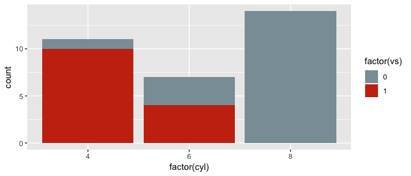
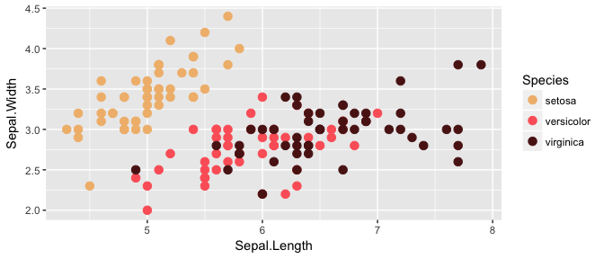

<!-- README.md is generated from README.Rmd. Please edit that file -->
Wes Anderson Palettes
=====================

[](https://travis-ci.org/karthik/wesanderson)


> I saved you from boring plots. What did you ever do? - Max Fischer (probably)

Tired of generic mass produced palettes for your plots? Short of adding an owl and dressing up your plot in a bowler hat, here's the most indie thing you can do to one. First round of palettes derived from the amazing Tumblr blog [Wes Anderson Palettes.](http://wesandersonpalettes.tumblr.com/)

Installation
------------

``` r
install.packages("wesanderson")
```

**Or the development version**

``` r
devtools::install_github("karthik/wesanderson")
```

Usage
-----

``` r
library("wesanderson")

# See all palettes
names(wes_palettes)
#>  [1] "BottleRocket1"  "BottleRocket2"  "Rushmore1"      "Rushmore"      
#>  [5] "Royal1"         "Royal2"         "Zissou1"        "Darjeeling1"   
#>  [9] "Darjeeling2"    "Chevalier1"     "FantasticFox1"  "Moonrise1"     
#> [13] "Moonrise2"      "Moonrise3"      "Cavalcanti1"    "GrandBudapest1"
#> [17] "GrandBudapest2" "IsleofDogs1"    "IsleofDogs2"
```

### Bottle Rocket (1996)

``` r
wes_palette("BottleRocket1")
```


``` r
wes_palette("BottleRocket2")
```


### Rushmore (1998)

``` r
wes_palette("Rushmore1")
```


### The Royal Tenenbaums (2001)

``` r
wes_palette("Royal1")
```


``` r
wes_palette("Royal2")
```


``` r
library("ggplot2")
ggplot(mtcars, aes(factor(cyl), fill=factor(vs))) +  geom_bar() +
  scale_fill_manual(values = wes_palette("Royal1"))
```



### The Life Aquatic with Steve Zissou (2004)

``` r
wes_palette("Zissou1")
```


### The Isle of Dogs

``` r
wes_palette("IsleofDogs1")
```


``` r
wes_palette("IsleofDogs2")
```


``` r
pal <- wes_palette("Zissou1", 21, type = "continuous")
image(volcano, col = pal)
```


``` r
pal <- wes_palette("Zissou1", 100, type = "continuous")
# heatmap is a local dataset
ggplot(heatmap, aes(x = X2, y = X1, fill = value)) +
  geom_tile() + 
  scale_fill_gradientn(colours = pal) + 
  scale_x_discrete(expand = c(0, 0)) +
  scale_y_discrete(expand = c(0, 0)) + 
  coord_equal() 
```


### The Darjeeling Limited (2007)


``` r
wes_palette("Darjeeling1")
```


``` r
wes_palette("Darjeeling2")
```


### Hotel Chevalier (2007)

``` r
wes_palette("Chevalier1")
```


### Fantastic Mr. Fox (2009)

``` r
wes_palette("FantasticFox1")
```


### Moonrise Kingdom (2012)

``` r
wes_palette("Moonrise1")
```


``` r
wes_palette("Moonrise2")
```


``` r
wes_palette("Moonrise3")
```


### Castello Cavalcanti (2013)

``` r
wes_palette("Cavalcanti1")
```


### The Grand Budapest Hotel (2014)

``` r
wes_palette("GrandBudapest1")
```


``` r
wes_palette("GrandBudapest2")
```


``` r
ggplot(iris, aes(Sepal.Length, Sepal.Width, color = Species)) + 
  geom_point(size = 3) + 
  scale_color_manual(values = wes_palette("GrandBudapest1")) + 
  theme_gray()
```



Gallery of examples
-------------------

-   [Reading Secure Data Into R from Dropbox](http://aaronbaggett.com/notes/2014/03/28/reading-secure-data-into-r-from-dropbox/)


